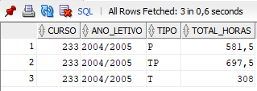

## Query
```sql
SELECT
    ucs.curso,
    tipo.ano_letivo,
    tipo.tipo,
    SUM(turnos * horas_turno) as total_horas
FROM
    XUCS ucs
JOIN
    XTIPOSAULA tipo ON
        tipo.codigo = ucs.codigo
WHERE
    ucs.curso = 433 AND
    tipo.ano_letivo = '2004/2005'
GROUP BY
    ucs.curso,
    tipo.ano_letivo,
    tipo.tipo;
```

## Answer


## Execution Plans


