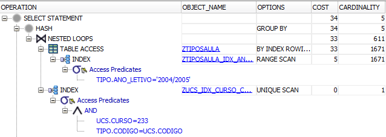

# Question 2
## Query
```sql
SELECT
    ucs.curso,
    tipo.ano_letivo,
    tipo.tipo,
    SUM(turnos * horas_turno) as total_horas
FROM
    XUCS ucs
JOIN
    XTIPOSAULA tipo ON
        tipo.codigo = ucs.codigo
WHERE
    ucs.curso = 233 AND
    tipo.ano_letivo = '2004/2005'
GROUP BY
    ucs.curso,
    tipo.ano_letivo,
    tipo.tipo;
```

## Answer


## Execution Plans
#### Execution Plan X


Starting off with environment X, the first step is to filter both XUCS and XTIPOSAULA tables to reduce their sizes and reduce the cost of the join operation. Since there are no indexes at all, especially on XUCS.CURSO and XTIPOSAULA.ANO_LETIVO, the only way to filter the tables is by performing a Full Table Scan and check each row of the table.  
Note that filtering XTIPOSAULA returns 1671 rows, while the whole table has 21019 rows, which make the subsequent join much faster. However, this represents the hardest operation of the query, having a cost of 36.  
When it comes to the join operation, there are some possibilities available. The system could have performed a Nested Loops Join or a Sort-Merge Join, but instead it chose a Hash Join. We believe the main reason is the filtered tables size. Since the tables are not small, to sort them might be too heavy and to have one of them totally in memory might be unfeasible. Hence, the Hash Join becomes the best solution with just a cost of 1 in this query.  
Finally, since we need to GROUP BY our results, an Hash operation is executed to place all similiar (CURSO, ANO_LETIVO, TIPO) tuples in the same bucket and then summing the product of TURNOS by HORAS_TURNO in each of those buckets. A very interesting use for a hash function in our opinion!

#### Execution Plan Y


This plan is exactly the same as the above for environment X. The reason is that there are no indexes on YUCS.CURSO and YTIPOSAULA.ANO_LETIVO, which would replace the Full Table Scan with a Table Access by Rowid after performing a Full/Range Index Scan.  
In addition, although YUCS.CODIGO has a unique index (created by the primary key constraint), since YTIPOSAULA.CODIGO does not have an index the join cannot be optimized. It still is cheaper to filter the tables and then join normally than to perform a join by indexes and only then fetch the rows from the tables by rowid.

#### Execution Plan Z


Since we only need the columns CURSO (in the SELECT and WHERE clauses) and CODIGO (for the JOIN) from the table ZUCS, we decided to create a B-Tree index on the both columns simultaneously, thus eliminating the need to access the table ZUCS. Furthermore, CODIGO is a primary key, which makes the pair (CURSO, CODIGO) always unique. We used this to make the index unique, thus allowing for a quick Unique Scan on the index which greatly improved the performance of the query. Finally, the index is joined to ZTIPOSAULA through the column CODIGO using the Nested Loops Join. This is a good option because the index is very small, having only two columns and 83 rows that satisfy the condition ZUCS.CURSO = 433, so the Nested Loops is faster than other join operations.  
Note: We believe the cost estimate for the Unique Scan operation is wrong. As stated before, there are 83 rows returned by that index access, which is a lot more than the cardinality of 1 estimated. That said, we ran a query that only used the index and achieved a cost of 2 and a cardinality of 83. Therefore, the real cost for the question's query should be 39.



This query could be further optimized with an index on ZTIPOSAULA.ANO_LETIVO (as stated in the analysis for environment Y and shown on the image above) allowing for a Range Scan on the index with a subsequent table access By Rowid. This would lead to an overall cost of 34. However, since there is not much gain and there are other indices that also use this column, we decided not to keep it for other questions in order to save space and time that would be otherwise wasted maintaining that index (assuming a fully operational database on a real world system).

### Execution Time

| X Schema | Y Schema | Z Schema (Cost 37) | Z Schema (Cost 34) |
|----------|----------|--------------------|--------------------|
| 0.522s   | 0.038s   | 0.026s             | 0.022s             |

```sql
CREATE UNIQUE INDEX ZUCS_IDX_CURSO_CODIGO ON ZUCS(curso, codigo)
```
