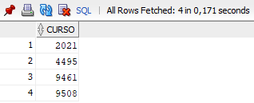
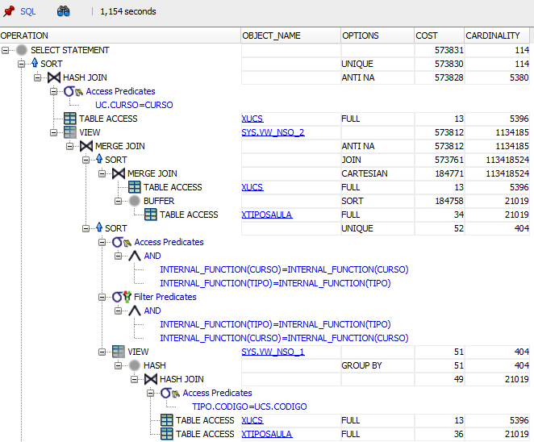
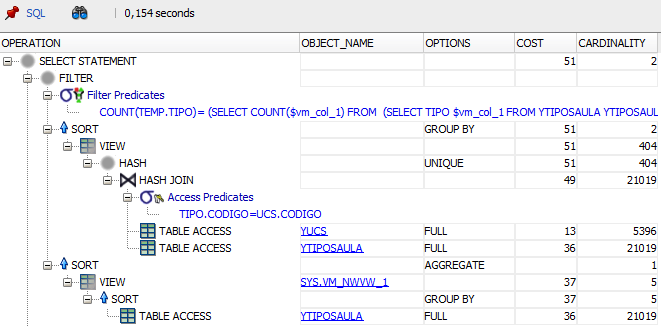

## Query
```sql
SELECT
    temp.curso
FROM (
    SELECT DISTINCT
        ucs.curso,
        tipo.tipo
    FROM
        XUCS ucs
    JOIN
        XTIPOSAULA tipo ON
            tipo.codigo = ucs.codigo) temp
HAVING
    COUNT(temp.tipo) = (
    SELECT 
        COUNT(DISTINCT tipo)
    FROM 
        XTIPOSAULA)
GROUP BY
    temp.curso
ORDER BY
    temp.curso;
```

## Answer


## Execution Plans

VS.



