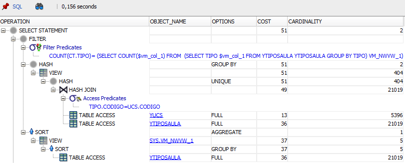

# Question 6
For this question we developed two different queries, both yieldying the same result. Since both have a very distinct formulation and complexity, we chose to analyze both separately. Lets start with option A.

## Option A
Our first approach is rather simple: count the number of distinct types of classes and then select the programs whose number of types of classes matched the amount counted before. This query allowed us to get the answer very quickly and with a good degree of confidence. However, it feels like cheating because we are not actually confirming which types each program has, just that they have the right number of types.

### Query
```sql
SELECT
    ct.curso
FROM (
    SELECT DISTINCT
        ucs.curso,
        tipo.tipo
    FROM
        XUCS ucs
    JOIN
        XTIPOSAULA tipo ON
            tipo.codigo = ucs.codigo) ct
HAVING
    COUNT(ct.tipo) = (
        SELECT 
            COUNT(DISTINCT tipo)
        FROM 
            XTIPOSAULA)
GROUP BY
    ct.curso;
```

### Answer


### Execution Plans


In this query the usual "filter then join" method does not work. The filter applied in the HAVING clause has to be applied to the whole table returned by the nested SELECT. That is where the optimizer starts: it performs a Hash Join with two Full Table Scans to join XUCS with XTIPOSAULA. There is no way around it, the tables are too large (XTIPOSAULA has 21019 rows) so sorting them for a Sort Merge would cost too much and completely loading one of them to memory for a Nested Loops does not seem feasible. After the Hash Join, the values are filtered by the DISTINCT keywrod, which in practice means a hash function is used to place each unique value in a different bucket, discarding hash collisions, thus only saving each value once. Finally, the resulting values are group by CURSO so that the COUNT operation is performed only once per CURSO.  
Afterwards, the expression inside the HAVING clause has to be computed. The optimizer performs some manipulation on this expression that can be read on the "Filter Predicates" line of the execution plan. The DISTINCT keyword is replaced by a GROUP BY and an alias VM_NWVW_1 is used to refer to the selection made on XTIPOSAULA table. This selection is planned on the bottom of the execution plan. As we can see, the optimizer performs a Full Table Scan on XTIPOSAULA followed by a sort operation to separate the rows into different groups, each with the same value for the TIPO column. The resulting table is then aggregated by the COUNT operation and finally used to filter the XUCS and XTIPOSAULA join. After applying the filter, the optimizer ends up selecting the column CURSO for the resulting rows.



This plan is exactly the same as the one for environment X. Although we now have an index on YUCS.CODIGO, that is not enough to optimize this query. The reason is that we need both YUCS.CURSO and YUCS.CODIGO for this query, so even if the optimizer used the index to make the join faster, it would need to afterwards join with the full YUCS table to get the CURSO column. Other way the optimizer could go was to access YUCS by Rowid after querying the index. However, since we need all rows from both tables, accessing the index would be a waste of time when it can directly scan the table and get all rows with all information.  
That said we could clearly benefit from an index on both CODIGO and CURSO (by this order), thus completely eliminating the need to access the YUCS table. Apart from YUCS.CODIGO there is no other index available for this query, so there is nothing that could be further optimized in this execution plan.


As suggested in the analysis for environment Y, an index on both ZUCS.CODIGO and ZUCS.CURSO improves the query as we can see in the execution plan above. Since those are the only columns we need in this query from ZUCS, the need to get rows from the original table does no longer exist. Because of this the Hash Join is now performed on the index through a Fast Full Scan instead of a Full Table Scan on ZUCS, droping the cost from 13 to 6. This is already good and allows us to reuse an index that already existed from previous questions. However, there are only two more columns being used in the query: ZTIPOSAULA.CODIGO and ZTIPOSAULA.TIPO. By creating an index on both of these columns in the same order we can further optimize the query:

```sql
CREATE INDEX ZTIPOSAULA_IDX_CODIGO_TIPO ON ZTIPOSAULA (CODIGO, TIPO)
```


This index has a bigger impact than the previous one because the table ZTIPOSAULA was being used in two distinct parts of the execution plan. First, the Hash Join no longer needs to access table ZTIPOSAULA as a Fast Full Scan on the index is enough to join through the CODIGO column and to fetch the TIPO column. This operation has half the cost of a Full Table Scan on ZTIPOSAULA, which is quite a big improvement. In addition, the selection of distinct TIPOs is also improved since it can perform the whole query on the index.  
Overall, by using both proposed indexes (ZUCS_IDX_CURSO_CODIGO and ZTIPOSAULA_CODIGO_TIPO) we are able to cut the cost of the query in half. This would be a very important optimization if this query was very frequent on a running system.

## Option B
Our second approach is way more complex. It is heavily based on set theory. We start by creating a set with all possible pairs of program and type of class. Afterwards, we subtract this set by the set of pairs which are actually stored on the database. The resulting set is made of all pairs that should to exist in order for all programs to have classes of all types. This means that the programs which already have all types of classes are removed by subtracting the two sets. Based on this, we subtract the set of all programs on the database by the set of programs that were part of the subtraction made before and we end up with the answer.  
Translating this to SQL took a bit of effort, but the end result actually checks that the programs have every type instead of counting them. However, this query takes approximately 6 minutes to run, which is a lot slower than option A. 

### Query
```sql
SELECT DISTINCT -- Select 4
    uc.curso
FROM 
    XUCS uc
WHERE
    uc.curso NOT IN (
        SELECT DISTINCT -- Select 3
            ctp.curso
        FROM (
            SELECT DISTINCT -- Select 2
                curso,
                tipo
            FROM
                XUCS,
                XTIPOSAULA) ctp
        WHERE
            (ctp.curso, ctp.tipo) NOT IN (
                SELECT DISTINCT -- Select 1
                    ucs.curso,
                    tipo.tipo
                FROM
                    XUCS ucs
                JOIN
                    XTIPOSAULA tipo ON
                        tipo.codigo = ucs.codigo));
```

### Answer


### Execution Plans


Due to the complexity of this query, we have marked each SELECT to help on the explanation of the execution plan. The first one to be computed is Select 1, which is essentially the same as option's A nested select. Both XUCS and XTIPOSAULA are completely joined through the column CODIGO using an Hash Join to the cardinality of both tables. Afterwards, they are grouped using an hash operation to eliminate duplicates.  
The second select to be computed is the number 2. This query will joined all existing CURSOs and TIPOs by performing a cartesian product on tables XUCS and XTIPOSAULA. Since both tables have a big cardinality, a Nested Loops is impossible. The Hash Join could be a possibility, just like in Select 1, but this time there is no condition to match, which makes the Sort-Merge Join a better alternative for joining all columns from one table to the other. The optimizer uses a buffer to Sort all rows from XTIPOSAULA, which has a tremendous cost but is a necessary evil. The overall cost of the Select 2 execution is quite big, having a cost of 184771 at the end of the Sort-Merge Join.  
However, it is the cost of Select 3 that goes through the ceiling. This query has to filter the CURSOs that appear in Select 2 but not in Select 1. Due to the huge number of rows involved, the best option is a Anti Sort-Merge Join on the results of those two selects. This operation does exactly what we need: it merges the tables by excluding the rows that share values on both of them. The problem is that we have to sort 113 million of rows from Select 2. As expected, this operation represents pretty much the cost of the whole query and is the clear bottleneck of performance.  
To finish the operation and yield the expected results, the last step is to select the values of XUCS.CURSO that exist on the database but not on the result of Select 3. The NOT IN operation is actually interpreted as a anti join with an equality condition on CURSO, which leads the optimizer to choose an Anti Hash Join using the CURSO as the access predicate. Finally, the resulting values are hashed to remove duplicates and the query completes after *just* 6 minutes.


This execution plan is exactly the same as the above and the reasons are the same as option A's. Therefore we will not dive into much detail here. There simply is no way to get the information needed for the query through the index, making accessing it a worse option. This time though an index just on YUCS.CURSO would actually benefit Select 3 which would not need to perform a Full Table Access on YUCS. Since CURSO is not a primary key, the index does not exist and thus there is no optimization at all.


By using the same indexes from option A we achieve drastically different results. Not only the query runs in approximately 24 seconds, but also the cost of the query is 5 times lower. Note that even the estimated cardinality is much more close to the real result of 5 rows (this plan estimates 54 while the last two expected 114).  
The reason is clear: we are only accessing indexes, which are much smaller than corresponding tables. This makes a big difference especially for Select 2 that had to calculate a cartesian product between two tables. The Sort-Merge Join is carried out pretty much in the same way, but the indexes are much faster to sort due to their sizes.  
Interestingly enough, the plans for Selects 1 and 3 change quite a bit. This happens due to a major refactor on the way Select 3 is computed. Instead of using a Sort-Merge Join to join the results of Selects 1 and 2, the optimizer converts the NOT IN operation on a NOT EXISTS for these two tables. The whole Filter Predicate is hard to understand, but it seems the optimizer is binding the CURSO and TIPO values in a variable and iterating over the tables to guarantee the deletion of duplicates for Select 3.  
Something similar happens for Select 1. The optimizer prefers to access both indexes through Fast Full Scans and merge them through a Semi Hash Join. The indexes are filtered to remove duplicates even before the join operation. A semi join stops when the first hit is encountered, which makes sense since both indexes do not contain duplicate values. This way, the optimizer can calculate the buckets for the index ZTIPOSAULA_IDX_CODIGO_TIPO (where there are many TIPOs for the same CODIGO) and then go through the index ZUCS_IDX_CURSO_CODIGO (where there is only one CURSO for each CODIGO) to find the first bucket with a match on CODIGO and stop there to save some time.  
The Select 3 plan has already been explaining above. After its results are calculated, the last step is to merge them with the index on ZUCS through an Anti Hash Join. The Anti method will return the CURSOs that exist on the index but not on the result of Select 3. The Hash Join is obviously the best operation due to the equality condition used to match the two entities.
Finally, an Hash operation is used to remove duplciates from the result, thus giving us the expected CURSOs. What an amazing optimization we achieved with this query.

## Execution Times

|          | X Schema | Y Schema | Z Schema |
|----------|----------|----------|----------|
| Option A | 344s     | 321s     | 23s      |
| Option B | 0.036s   | 0.040s   | 0.036s   |

### References
[Oracle Community - What does "2 - access("DEPARTMENT_ID"=:B1)" Mean](https://community.oracle.com/tech/developers/discussion/2512264/execution-plan-what-does-2-access-department-id-b1-mean)  
[Ask Tom - Hash Join Semi](https://asktom.oracle.com/pls/apex/f?p=100:11:0::::P11_QUESTION_ID:561666200346114038)