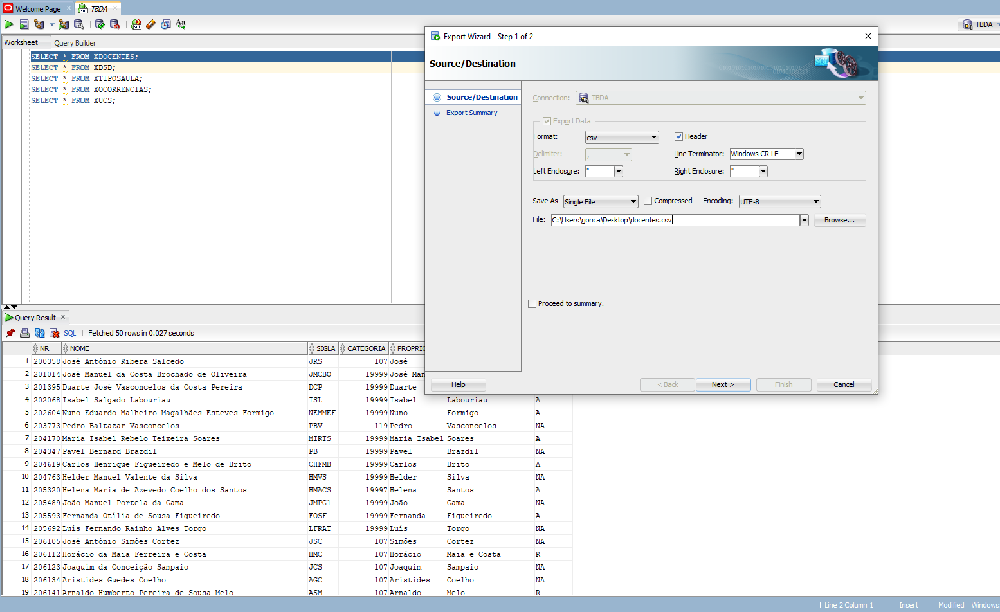
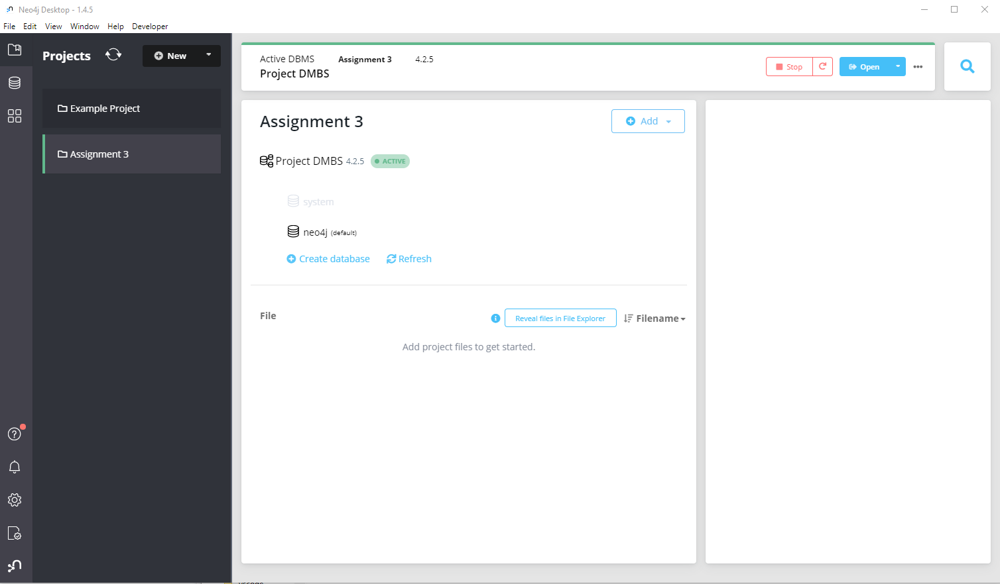

# How to migrate to neo4j

1. Export every table to a `.csv` file

```sql
SELECT * FROM XDOCENTES;
SELECT * FROM XDSD;
SELECT * FROM XTIPOSAULA;
SELECT * FROM XOCORRENCIAS;
SELECT * FROM XUCS;
```



2. Create a new project in Neo4j Desktop, with DMBS and database



3. Move the `.csv` files in the `data` to the folder located on `path/to/.Neo4jDesktop/relate-data/dbmss/dbms-[new-project-hash]/import/`.

4. Run the `create.cypher` in the Neo4j browser